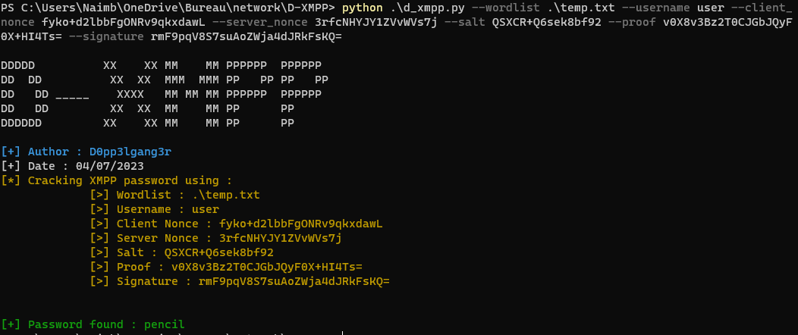

# D-XMPP
## Description EN
Based on these explanation : https://stackoverflow.com/questions/29298346/xmpp-sasl-scram-sha1-authentication. 
This tool has been made to crack the password of an XMPP Authentication. 

  

## Description FR
Basé sur ces explications : https://stackoverflow.com/questions/29298346/xmpp-sasl-scram-sha1-authentication. 
L'outil a été conçu dans le but de retrouver le mot de passe d'une authentification XMPP. 

  

